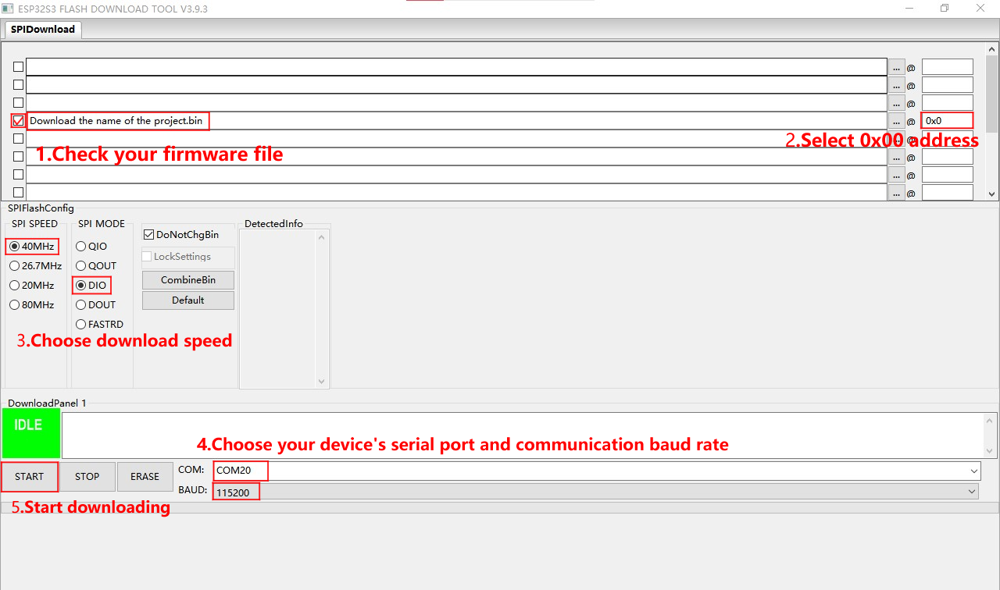

<!--
 * @Description: None
 * @Author: kosamit
 * @Date: 2026-03-18 23:00:00
 * @LastEditTime: 2026-03-18 23:00:00
-->
<h1 align = "center">QQQQ</h1>

## バージョン履歴

| バージョン |   更新日   |     更新内容     |
| :--------: | :--------: | :--------------: |
|    V0.1    | 2026-03-18 | テストモジュール |

## 目次

- [概要](#概要)
- [ドライバー・ソフトウェア構成](#ドライバーソフトウェア構成)
- [プレビュー](#プレビュー)
- [モジュール](#モジュール)
- [ソフトウェア導入](#ソフトウェア導入)
- [ピン一覧](#ピン一覧)
- [関連テスト](#関連テスト)
- [よくある質問](#よくある質問)
- [プロジェクト](#プロジェクト)

## 概要

QQQQ(Quad Q)はポケットサイズのドラムパッドを持ったMIDIデバイスです。
T-Display-S3-Pro-MVSRBoardでプロトタイプの開発を行っています。

T-Display-S3-Pro-MVSRBoard は [T-Display-S3-Pro](https://github.com/Xinyuan-LilyGO/T-Display-S3-Pro) マザーボード用のバックプレートで、オンボードスピーカーとマイクを極めて低い静止電流で拡張できます。加えて、振動と RTC（リアルタイムクロック）機能を備えています。

T-Display-S3-Pro-MVSRBoard_V1.0を使っています。

**ランタイム:** 本プロジェクトでは **FreeRTOS** をリアルタイム OS として採用しています（ESP32-S3 上の ESP-IDF / Arduino フレームワーク経由）。マルチタスクは FreeRTOS のタスク（タッチ・表示・クロックなど）と同期プリミティブ（キュー、セマフォ）で実装されています。

## ドライバー・ソフトウェア構成

本プロジェクトで使用するディスプレイ・周辺ドライバーおよび主要ライブラリの一覧です。

| カテゴリ             | ハードウェア / 機能                                 | ドライバー / ライブラリ             | バス / インターフェース                           |
| :------------------- | :-------------------------------------------------- | :---------------------------------- | :------------------------------------------------ |
| **OS / ランタイム**  | タスクスケジューリング、同期                        | FreeRTOS (ESP-IDF)                  | —                                                 |
| **ディスプレイ**     | LCD (ST7796, 222×480)                               | Arduino_GFX (Arduino_ST7796)        | SPI (Arduino_HWSPI: DC, CS, SCK, MOSI, MISO, RST) |
| **タッチ**           | 静電容量式タッチ (CST226SE)                         | Arduino_DriveBus (Arduino_CST2xxSE) | I2C (Arduino_HWIIC)、RST、INT                     |
| **スピーカー**       | MAX98357A (I2S DAC/アンプ)                          | ESP32-audioI2S (Audio)              | I2S (BCLK, LRCLK, DATA, SD_MODE)                  |
| **マイク**           | V1.0: MSM261S4030H0R (I2S) / V1.1: MP34DT05-A (PDM) | Arduino_DriveBus (Arduino_MEMS)     | I2S/PDM (BCLK, WS/LRCLK, DATA, EN)                |
| **RTC**              | PCF85063ATL                                         | Arduino_DriveBus (Arduino_PCF85063) | I2C (SDA, SCL)、INT                               |
| **電源 / バッテリ**  | SY6970 (充電・ADC)                                  | Arduino_DriveBus (Arduino_SY6970)   | I2C                                               |
| **振動**             | 振動モーター                                        | ESP32 LEDC (PWM)                    | GPIO 45                                           |
| **ディスプレイ電源** | RT9080 (LDO)                                        | GPIO                                | EN → GPIO 42                                      |
| **SDカード**         | SDスロット                                          | Arduino SD / SPI                    | SPI (CS, MISO, MOSI, SCK)                         |
| **BLE MIDI**         | Bluetooth LE MIDI                                   | BLE-MIDI (Arduino-BLE-MIDI)         | BLE                                               |

- **ディスプレイ:** ST7796 を Arduino_GFX で HW SPI 駆動。解像度 222×480、IPS。
- **FreeRTOS:** タッチ・表示・クロック用タスク、キュー、ミューテックスに使用。Arduino の `setup()` / `loop()` は Core 1 で実行。

## プレビュー

### 実機画像

## モジュール

### 1. スピーカー

- チップ: MAX98357A
- バス通信プロトコル: I2S
- その他: デフォルトで 9dB ゲインを使用
- 関連資料:
  > [MAX98357A](./information/MAX98357AETE+T.pdf)
- 依存ライブラリ:
  > [Arduino_DriveBus-1.1.16]()

### 2. マイク

> #### T-Display-S3-Pro-MVSRBoard_V1.0 版
>
> - チップ: MSM261S4030H0R
> - バス通信プロトコル: I2S
> - 関連資料:
>   > [MSM261S4030H0R](./information/MEMSensing-MSM261S4030H0R.pdf)
> - 依存ライブラリ:
>   > [Arduino_DriveBus-1.1.16]()

> #### T-Display-S3-Pro-MVSRBoard_V1.1 版
>
> - チップ: MP34DT05-A
> - バス通信プロトコル: PDM
> - 関連資料:
>   > [MP34DT05-A](./information/mp34dt05-a.pdf)
> - 依存ライブラリ:
>   > [Arduino_DriveBus-1.1.16]()

### 3. 振動

- バス通信プロトコル: PWM

### 4. RTC

- チップ: PCF85063ATL
- バス通信プロトコル: I2C
- 関連資料:
  > [PCF85063ATL](./information/PCF85063ATL-1,118.pdf)
- 依存ライブラリ:
  > [Arduino_DriveBus-1.1.16]()

## ソフトウェア導入

### サンプル対応状況

| サンプル                                                            | `[PlatformIO IDE][espressif32-v6.5.0]` `[Arduino IDE][esp32_v2.0.14]` | 説明               | 画像 |
| ------------------------------------------------------------------- | -------------------------------------------------------------------------- | ------------------ | ---- |
| [CST226SE](./examples/CST226SE)                                     | 
![alt text][supported]                                   |                    |      |
| [Deep_Sleep_Wake_Up](./examples/Deep_Sleep_Wake_Up)                 | 
![alt text][supported]                                   |                    |      |
| [DMIC_ReadData](./examples/DMIC_ReadData)                           | 
![alt text][supported]                                   |                    |      |
| [DMIC_SD](./examples/DMIC_SD)                                       | 
![alt text][supported]                                   |                    |      |
| [Get_HTTP_Response_Time](./examples/Get_HTTP_Response_Time)         | 
![alt text][supported]                                   |                    |      |
| [GFX](./examples/GFX)                                               | 
![alt text][supported]                                   |                    |      |
| [IIC_Scan_2](./examples/IIC_Scan_2)                                 | 
![alt text][supported]                                   |                    |      |
| [Original_Test](./examples/Original_Test)                           | 
![alt text][supported]                                   | 工場出荷プログラム |      |
| [PCF85063](./examples/PCF85063)                                     | 
![alt text][supported]                                   |                    |      |
| [PCF85063_Scheduled_INT](./examples/PCF85063_Scheduled_INT)         | 
![alt text][supported]                                   |                    |      |
| [PCF85063_Timer_INT](./examples/PCF85063_Timer_INT)                 | 
![alt text][supported]                                   |                    |      |
| [RT9080](./examples/RT9080)                                         | 
![alt text][supported]                                   |                    |      |
| [SD_Explorer_Music](./examples/SD_Explorer_Music)                   | 
![alt text][supported]                                   |                    |      |
| [SD_Music](./examples/SD_Music)                                     | 
![alt text][supported]                                   |                    |      |
| [SY6970](./examples/SY6970)                                         | 
![alt text][supported]                                   |                    |      |
| [SY6970_OTG](./examples/SY6970_OTG)                                 | 
![alt text][supported]                                   |                    |      |
| [USB_Host_Camera_Screen](./examples/USB_Host_Camera_Screen)         | 
![alt text][supported]                                   |                    |      |
| [Vibration_Motor](./examples/Vibration_Motor)                       | 
![alt text][supported]                                   |                    |      |
| [WIFI_HTTP_Download_File](./examples/WIFI_HTTP_Download_File)       | 
![alt text][supported]                                   |                    |      |
| [WIFI_HTTP_Download_SD_file](./examples/WIFI_HTTP_Download_SD_file) | 
![alt text][supported]                                   |                    |      |
| [Wifi_Music](./examples/Wifi_Music)                                 | 
![alt text][supported]                                   |                    |      |

[supported]: https://img.shields.io/badge/-supported-green "example"

| ファームウェア                                                                                                                                                              | 説明               | 画像 |
| --------------------------------------------------------------------------------------------------------------------------------------------------------------------------- | ------------------ | ---- |
| [Original_Test(T-Display-S3-Pro-MVSRBoard_V1.0)](./firmware/[T-Display-S3-Pro-MVSRBoard_V1.0][Original_Test]_firmware_V1.0.1.bin)                                           | 工場出荷プログラム |      |
| [Original_Test(T-Display-S3-Pro-MVSRBoard_V1.1)](<./firmware/(麦克风数据字体颜色从白色改成蓝色)[T-Display-S3-Pro-MVSRBoard_V1.1][Original_Test]_firmware_202412261832.bin>) | 工場出荷プログラム |      |

### PlatformIO

1. [Visual Studio Code](https://code.visualstudio.com/Download) をインストールし、お使いの OS に合わせて選択してください。

2. VS Code のサイドバーで「拡張機能」を開く（<kbd>Ctrl</kbd>+<kbd>Shift</kbd>+<kbd>X</kbd> でも可）。「PlatformIO IDE」を検索してインストールしてください。

3. 拡張機能のインストール中に、GitHub から本リポジトリを取得できます。「<> Code」の緑ボタンでメインブランチをダウンロードするか、サイドバーの「Releases」から特定バージョンを取得できます。

4. 拡張機能のインストール後、サイドバーの「エクスプローラー」を開き（<kbd>Ctrl</kbd>+<kbd>Shift</kbd>+<kbd>E</kbd> でも可）、「フォルダを開く」でダウンロードしたプロジェクトのルートフォルダを選択し「追加」してください。プロジェクトがワークスペースに追加されます。

5. プロジェクトフォルダ内の「platformio.ini」を開きます（フォルダ追加時に PlatformIO が自動で開く場合があります）。`[platformio]` セクションで、書き込みたいサンプルに対応する行（`default_envs = xxx`）のコメントを外して選択し、左下の「<kbd>[√](image/4.png)</kbd>」でビルドしてください。ビルドが成功したらマイコンを接続し、左下の「<kbd>[→](image/5.png)</kbd>」で書き込みます。

### Arduino

1. [Arduino](https://www.arduino.cc/en/software) をインストールし、お使いの OS に合わせて選択してください。

2. プロジェクトフォルダ内の「example」ディレクトリから、使いたいサンプルのフォルダを選び、拡張子「.ino」のファイルを開いて Arduino IDE のワークスペースとして開きます。

3. メニュー「ツール」→「ボード」→「ボードマネージャ」を開き、「esp32」で検索して「Espressif Systems」のボードパックをインストールします。その後「ボード」メニューから「ESP32 Arduino」の該当ボードを選びます。選択するボードは、プロジェクトの「platformio.ini」の `[env]` 内の `board = xxx` と一致させてください。一覧にない場合は、プロジェクト内の「board」フォルダから手動で追加する必要がある場合があります。

4. メニュー「[ファイル](image/6.png)」→「[環境設定](image/6.png)」で「[スケッチの保存場所](image/7.png)」を確認し、プロジェクトの「libraries」フォルダ内のライブラリをすべて、そのスケッチ保存場所内の「libraries」フォルダにコピーしてください。

5. 「ツール」メニューで下表のとおり設定してください。

#### ESP32-S3

|         設定項目         |               値                |
| :----------------------: | :-----------------------------: |
|          ボード          |       ESP32S3 Dev Module        |
|     アップロード速度     |             921600              |
|         USB Mode         |      Hardware CDC and JTAG      |
|     USB CDC On Boot      |             Enabled             |
| USB Firmware MSC On Boot |            Disabled             |
|     USB DFU On Boot      |            Disabled             |
|      CPU Frequency       |          240MHz (WiFi)          |
|        Flash Mode        |            QIO 80MHz            |
|        Flash Size        |          16MB (128Mb)           |
|     Core Debug Level     |              None               |
|     Partition Scheme     | 16M Flash (3MB APP/9.9MB FATFS) |
|          PSRAM           |            OPI PSRAM            |
|     Arduino Runs On      |             Core 1              |
|      Events Run On       |             Core 1              |

6. 正しい COM ポートを選択してください。

7. 右上の「<kbd>[√](image/8.png)</kbd>」でビルドし、成功したらマイコンを接続して右上の「<kbd>[→](image/9.png)</kbd>」で書き込んでください。

### ファームウェアの書き込み（ツール使用）

1. プロジェクトの「tools」フォルダ内の ESP32 用書き込みツールを開きます。

2. チップと書き込み方式を選択して「OK」をクリックし、画面の手順 1→2→3→4→5 の順で書き込んでください。失敗する場合は「BOOT-0」ボタンを押したまま再度書き込みを試してください。

3. プロジェクトルートの「[firmware](./firmware/)」フォルダ内のバイナリを書き込みます。ファームウェアのバージョン説明はフォルダ内にあるので、必要なバージョンを選んでください。

    
    

## ピン一覧

| スピーカー端子 | ESP32S3 ピン |
| :------------: | :----------: |
|      BCLK      |     IO4      |
|     LRCLK      |     IO15     |
|      DATA      |     IO11     |
|    SD_MODE     |     IO41     |

> #### T-Display-S3-Pro-MVSRBoard_V1.0 版(こちらを使用中)
>
> | マイク端子 | ESP32S3 ピン |
> | :--------: | :----------: |
> |    BCLK    |     IO1      |
> |     WS     |     IO10     |
> |    DATA    |     IO2      |
> |     EN     |     IO3      |

> #### T-Display-S3-Pro-MVSRBoard_V1.1 版
>
> | マイク端子 | ESP32S3 ピン |
> | :--------: | :----------: |
> |   LRCLK    |     IO1      |
> |    DATA    |     IO2      |
> |     EN     |     IO3      |

| 振動モーター端子 | ESP32S3 ピン |
| :--------------: | :----------: |
|       DATA       |     IO45     |

| RT9080 電源端子 | ESP32S3 ピン |
| :-------------: | :----------: |
|       EN        |     IO42     |

| RTC 端子 | ESP32S3 ピン |
| :------: | :----------: |
|   SDA    |     IO5      |
|   SCL    |     IO6      |
|   INT    |     IO7      |

## 関連テスト

### 消費電力

| ファームウェア                                                                                                        | プログラム                                          | 説明                                                                                                                                            | 画像 |
| --------------------------------------------------------------------------------------------------------------------- | --------------------------------------------------- | ----------------------------------------------------------------------------------------------------------------------------------------------- | ---- |
| [Deep_Sleep_Wake_Up](./firmware/[T-Display-S3-Pro-MVSRBoard_V1.0-V1.1][Deep_Sleep_Wake_Up]_firmware_202502051632.bin) | [Deep_Sleep_Wake_Up](./examples/Deep_Sleep_Wake_Up) | 静止電流: 1.22 μA。詳細は [消費電力テストログ](./relevant_test/PowerConsumptionTestLog_[T-Display-S3-Pro-MVSRBoard_V1.1]_20241210.pdf) を参照。 |      |

## トラブルシューティング

T-Display-S3-Pro-MVSRBoardは、[LilyGo-Document](https://github.com/Xinyuan-LilyGO/LilyGo-Document) の手順を参照して環境を構築してください。

 

- Q. 基板の「Uart」端子からシリアルデータが出ません。不良でしょうか？
- A. デフォルトではデバッグ用に USB が Uart0 のシリアル出力として使われています。「Uart」端子も Uart0 に接続されているため、設定を変えない限りここには出力されません。 PlatformIO の場合は、プロジェクトの「platformio.ini」を開き、`build_flags` 内の「-D ARDUINO_USB_CDC_ON_BOOT=true」を「-D ARDUINO_USB_CDC_ON_BOOT=false」に変更すると外部「Uart」が有効になります。 Arduino IDE の場合は「ツール」メニューで「USB CDC On Boot: Disabled」を選んでください。

 

- Q. プログラムの書き込みが何度も失敗します。
- A. 「BOOT-0」ボタンを押したまま、もう一度書き込みを試してください。

## T-Display-S3-Pro-MVSRBoardの詳細

- [T-Display-S3-Pro-MVSRBoard_V1.0](./project/T-Display-S3-Pro-MVSRBoard_V1.0.pdf)
- [T-Display-S3-Pro-MVSRBoard_V1.1](./project/T-Display-S3-Pro-MVSRBoard_V1.1.pdf)
